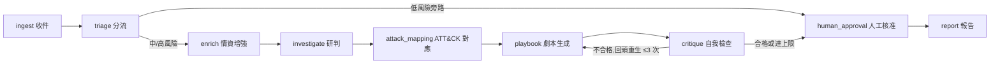

# 自主式 SOC Tier-1 事件回應代理

> 一條用 [LangGraph](https://github.com/langchain-ai/langgraph) 串起的事件回應流程：把資安告警自動做**第一線分流、情資增強、研判、ATT&CK 對應、劇本生成與報告**，並在任何處置前保留**人工核准**閘門。
>
> 國立清華大學 114-2「LLM 資安系統」期末專題（第 34 組）。
> 程式碼：**<https://github.com/JoeW00/llm_security_term_project>**
> 團隊整合報告：[`docs/reports/2026-W16-第34組-團隊整合報告.md`](docs/reports/2026-W16-第34組-團隊整合報告.md)

---

## 這是什麼

SOC（Security Operations Center，資安監控中心）每天收到大量告警，多數是誤報。本專案是一個自動化的 **Tier-1（第一線）事件回應代理**：告警進來後，它先分輕重、查威脅情資、用 LLM 研判真偽、對應 MITRE ATT&CK 攻擊手法、生成處置劇本並自我檢查，最後**交由人類核准才算數**——機器本身不執行任何破壞性處置。

核心發現：**「讓 LLM 讀告警內容」是一把雙面刃**——它讓研判更準（verdict 準確率 0.500 → 0.833），但同一條讀內容的路徑對提示注入（prompt injection）的被操控率達 1.000（3/3，小樣本）。因此系統以**縱深防禦**收尾：prompt 層的信任邊界降低被騙率，Pydantic 驗證擋住畸形輸出，`human_approval` 人工閘門阻斷「被騙輸出被自動採用」的後果。

---

## 流程



文字版：`ingest → triage → [route] → enrich → investigate → attack_mapping → playbook → [critique 迴圈] → human_approval → report`

- **`[route]`**：低風險告警直接旁路到 `human_approval`，不浪費後續算力（`soc_agent/routing.py`）。
- **`[critique 迴圈]`**：劇本不合格就把缺點回饋給 `playbook` 重生，由 `MAX_CRITIQUE_ITERATIONS=3` 保證終止。

---

## 快速開始

需要 [uv](https://github.com/astral-sh/uv)（Python 3.12）。

```bash
git clone https://github.com/JoeW00/llm_security_term_project.git
cd llm_security_term_project

uv sync                                   # 同步核心依賴（langgraph, pydantic）
uv run pytest -q                          # 跑測試（應 167 passed，離線、確定性、免金鑰）

# 跑單筆告警走完整流程（確定性離線預設，無需任何金鑰）
uv run python -m soc_agent run data/sample_alerts/ssh_bruteforce.json   # 高風險：完整路徑
uv run python -m soc_agent run data/sample_alerts/info_heartbeat.json   # 低風險：旁路
```

預設一切走**確定性離線實作**，不連網、不需金鑰，適合測試與展示。要接真實能力再選下面的選用群組。

---

## 選用能力（依需求開啟）

每個對外/LLM 邊界都有「離線確定性預設」＋「可注入的真實後端」，按需安裝對應依賴群組即可。

### 互動式 Demo UI（Streamlit）
```bash
uv run --group demo streamlit run demo/app.py
```
可視覺化跑流程、在人工核准關卡暫停/核准/駁回、執行注入測試套件。

### 地端 LLM 研判（ollama，無金鑰、告警不出企業邊界）
研判/劇本/反思可全本地跑（符合自託管 SOC 威脅模型）。需 [ollama](https://ollama.com) 並備妥模型，評估腳本示範：
```bash
ollama serve & ollama pull qwen2.5:7b
uv run --group eval python scripts/eval/run_local_cd_eval.py   # 確定性 vs 地端 LLM 研判/注入對照
```

### 雲端 LLM 研判（Anthropic，需金鑰）
```bash
ANTHROPIC_API_KEY=... uv run --group llm python -m soc_agent run data/sample_alerts/ssh_bruteforce.json --llm
```

### 真實威脅情資（abuse.ch ThreatFox）
abuse.ch 自 2024 起需[免費 Auth-Key](https://auth.abuse.ch)。把金鑰放進專案 `.env`（已被 gitignore）：
```bash
echo 'ABUSE_CH_AUTH_KEY=你的金鑰' >> .env       # 範本見 .env.example
uv run --group intel python -m soc_agent run --live-intel data/sample_alerts/ssh_bruteforce.json
```
`--live-intel` 啟用時 `enrich` 改查真實 abuse.ch；缺金鑰會收到 HTTP 401 並**安全降級為中性**（不謊稱惡意、不崩潰）。CLI 透過 `python-dotenv` 自動載入 `.env`。已以真實金鑰完成端到端三路徑實證：私有 IP 外送過濾、公網中性降級、即時惡意 IOC 命中（報告 §4.3）。

---

## 設計：可注入邊界

每個會碰 LLM、網路、外部工具或人工關卡的節點，都遵循同一模式（讓系統可離線測試、供應商無關、故障安全）：

> **`typing.Protocol` 介面 ＋ 離線確定性預設 ＋ Pydantic 驗證輸出 ＋ 失敗退回安全預設**

`build_graph()` 以 `functools.partial` 注入協作者，預設全為確定性實作：

```python
build_graph(
    classifier=...,        # 計畫 A：triage 分類器（RuleBased / Ollama 微調）
    enricher=...,          # 計畫 B：情資（Static / AbuseCh）
    attack_mapper=...,     # 計畫 B：ATT&CK 對應（Keyword / BM25 檢索）
    investigator=...,      # 計畫 C：研判（RuleBased / LLM）
    playbook_gen=...,      # 計畫 D：劇本（Template / LLM）
    critic=...,            # 計畫 D：自我批判（Deterministic / LLM rubric）
    approval_policy=...,   # 計畫 D：核准（AutoApprove / Interrupt 人工關卡）
    checkpointer=...,
)
```

**信任邊界**：告警欄位（`message` / `raw` / `indicators`）視為**不可信輸入**——絕不直接塞進 system prompt，只放入清楚分隔的 `<<<CONTEXT>>>` 區段；LLM 輸出在進入 `IncidentState` 前一律經 Pydantic 驗證，驗不過就退回確定性預設。

---

## 四個子系統（計畫 A–D）與代表結果

九個節點中，核心研判/處置節點由四個計畫接上真實能力；`ingest`/`route`/`human_approval`/`report` 負責資料整理、分流、把關與輸出，本就是確定性的。

| 計畫 | 節點 | 內容 | 代表結果 |
|---|---|---|---|
| **A** | `triage` | LoRA 微調本地分類器（GUIDE 資料集）＋ 四臂消融（含 32B 對照） | 誠實負面結果：三個 LLM 臂皆近乎坍縮，放大到 32B 反更差，瓶頸**指向匿名特徵資料集**而非模型容量；類別平衡重訓把 TP 召回 0 → 0.429 |
| **B** | `enrich` / `attack_mapping` | abuse.ch ThreatFox 查 IOC（含外送過濾，已用真實金鑰端到端實證）/ 對 MITRE STIX 手刻 BM25 檢索 | ATT&CK 對應 top-3 覆蓋 **0.750 vs 規則式 0.250**（12 筆） |
| **C** | `investigate` | LLM 讀告警內容判真偽（地端 qwen2.5:7b，temperature=0） | verdict 準確率 **0.500 → 0.833**、precision 1.000（6 筆地端評估） |
| **D** | `playbook` / `critique` / `human_approval` | LLM 生成 NIST 三階段劇本 ＋ rubric 評分反思迴圈 ＋ 核准閘門 | 收斂 100% 在 cap=3 內；注入被操控率 0/3（確定性）vs 3/3（LLM）→ 凸顯人工閘門必要性 |

> 所有數字皆為**小樣本**、已標註樣本數，不誇大；完整評估數據在 `results/`、執行證據截圖在 `docs/reports/assets/`、彙整論述見 [W16 團隊整合報告](docs/reports/2026-W16-第34組-團隊整合報告.md)。

---

## 程式結構

```
soc_agent/
    state.py          # IncidentState（TypedDict 契約）+ Alert（Pydantic）+ MAX_CRITIQUE_ITERATIONS=3
    nodes.py          # 9 個節點（皆回傳「部分狀態更新」，不原地改 state）
    routing.py        # route_after_triage（低風險旁路）+ route_after_critique（反思迴圈）
    graph.py          # build_graph()：組裝 StateGraph、注入各邊界
    __main__.py       # CLI：python -m soc_agent run <alert.json> [--llm --model --live-intel]
    classifier.py / classifiers/    # 計畫 A：Classifier 邊界 + OllamaClassifier + prompts
    enrichment.py / enrichers/      # 計畫 B：Enricher 邊界 + AbuseChEnricher + factory（讀 .env 金鑰）
    attack.py / attack_mappers/     # 計畫 B：AttackMapper 邊界 + 手刻 BM25 檢索
    reasoning.py / reasoners/       # 計畫 C/D：LLMClient/Investigator/Playbook/Critic + Anthropic/Ollama 後端
    approval.py / reporting.py      # 計畫 D：ApprovalPolicy（含真 LangGraph interrupt）+ Markdown/JSON 報告
data/sample_alerts/   # ssh_bruteforce.json（高風險）、info_heartbeat.json（低風險）
data/enterprise-attack.json   # MITRE ATT&CK STIX（BM25 檢索語料，697 個父技術）
eval/                 # 評估框架（triage / reasoning / injection / runtime / enrich / attack_mapping）
scripts/eval/         # 消融與評估腳本（run_ablation / run_injection / run_local_cd_eval / run_plan_b_attack_eval）
demo/                 # Streamlit Demo UI（controller 不依賴 streamlit、可單元測試）
tests/                # 167 個測試（全離線、確定性）
results/              # 跑出的真實評估數字（消融、注入、研判、ATT&CK 對應、情資 live 紀錄）
docs/reports/         # W16 團隊整合報告 + 個人進度報告 + 證據截圖（assets/）
docs/superpowers/     # 設計 spec 與實作計畫（四子系統）
```

---

## 評估與重現

所有報告數字都可由版控中的腳本重現（A 軸四臂消融需 2.4 GB GUIDE 資料與 32B 模型，為 DGX Spark 實機存檔；其餘可於本機重現）：

```bash
uv run pytest -q                                                 # 167 passed（離線）
uv run python scripts/eval/run_plan_b_attack_eval.py             # ATT&CK 對應消融（BM25 vs 關鍵字）
uv run --group eval python scripts/eval/run_local_cd_eval.py     # C/D 地端 LLM 評估（qwen2.5:7b，免金鑰）
OLLAMA_MODEL=llama3.2:3b uv run --group eval python scripts/eval/run_injection.py   # A 分流注入韌性
```

---

## 核心契約

- **`IncidentState`（`state.py`）是共用資料契約**——改它會波及所有節點與測試，視為高風險變更。
- **每個節點只回傳「部分狀態更新」**（它更新的鍵的 `dict`），絕不回傳整個 state、不原地修改；LangGraph 自動合併。
- **反思迴圈保證終止**：`critique_iterations` 遞增，達 `MAX_CRITIQUE_ITERATIONS`（3）或合格時離開。
- **`human_approval` 是處置前的安全閘門**——不讓代理在核准前行動。

---

## 開發慣例

- Python 3.12、`uv` 管理依賴、Pydantic v2、LangGraph。
- 每個 `.py` 檔頂端 `from __future__ import annotations`；型別註記必填。
- 測試必須**離線、確定性**（LLM/網路呼叫可注入或 patch）。
- ruff：`line-length=100`、`select=E/F/I/UP`。

```bash
uv run ruff format .        # 格式化
uv run ruff check --fix .   # lint（含 import 排序）
uv run pytest -q            # 測試
```

---

## 文件

| 文件 | 說明 |
|---|---|
| [W16 團隊整合報告](docs/reports/2026-W16-第34組-團隊整合報告.md) | 最終報告：系統設計、四子系統、資安評估、限制與結論 |
| [白話版專案總覽](docs/reports/白話版-專案總覽-小學生也看得懂.md) | 不懂資安也看得懂的整體介紹 |
| `docs/superpowers/specs/`、`docs/superpowers/plans/` | 四子系統的設計 spec 與實作計畫 |
| `results/` | 全部評估的原始數據（Markdown + JSON） |

---

## 授權與致謝

國立清華大學 114 學年度第 2 學期「LLM 資安系統」課程期末專題，第 34 組四人團隊共同完成（A 告警分流、B 情資增強與 ATT&CK 對應、C 研判與劇本、D 編排與安全）。私有學術用途，未授權公開散布。
