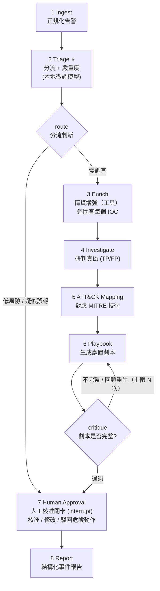

# 設計文件：自主式 SOC Tier-1 事件回應代理（LangGraph）

- **專案**：LLM 在資安領域的應用 — 概念驗證（PoC）
- **領域**：事件回應與劇本生成（Incident Response & Playbook Generation）
- **日期**：2026-05-24
- **團隊規模**：3–4 人
- **核心技術**：LLM Agent 編排、LangGraph、本地模型微調（LoRA）、提示注入韌性測試

---

## 1. 專題概述

建置一個「自主式 SOC Tier-1 事件回應代理」：輸入一筆真實資安告警，由 LangGraph 編排的 agent 自動完成**分流 → 情資增強 → 真偽研判 → MITRE ATT&CK 對應 → 處置劇本生成 → 自我批判反思 → 人工核准 → 結構化事件報告**的完整流程。

設計刻意採用需要「多步驟狀態流轉、條件路由、反思迴圈、工具呼叫、人機協作關卡」的結構——這正是 LangGraph 相對於單次 prompt 的價值所在，也直接對應課程學習目標「整合並部署多種核心技術於真實規模的資安系統」。

---

## 2. 系統架構（LangGraph 狀態圖）

> **共享 State**：`alert`, `alert_type`, `severity`, `iocs[]`, `enrichment`, `verdict`, `attack_techniques[]`, `playbook`, `critique`, `approved`, `final_report`

### 節點說明

| # | 節點 | 職責 | 模型 |
|---|---|---|---|
| 1 | **Ingest** | 正規化各來源告警為統一 schema | 規則/輕量解析 |
| 2 | **Triage** ⭐ | 分類告警類型 + 嚴重度 | **本地微調小模型**（LoRA + Ollama） |
| — | **route**（條件邊） | 低風險/疑似誤報走短路徑；高風險進入完整調查 | — |
| 3 | **Enrich** | 萃取 IOC，逐一呼叫威脅情資工具查證 | 雲端 API + 工具 |
| 4 | **Investigate** | 綜合情資研判真偽（TP/FP）+ 信心度 | 雲端 API |
| 5 | **ATT&CK Mapping** | 對應 MITRE ATT&CK 技術編號 | 雲端 API + 檢索 |
| 6 | **Playbook** | 生成逐步處置劇本（圍堵/根除/復原） | 雲端 API |
| — | **critique**（反思迴圈） | 檢查劇本完整性與安全性，不足則回頭重生（上限 N 次） | 雲端 API |
| 7 | **Human Approval** | LangGraph interrupt 中斷，人工核准/修改/駁回危險動作 | 人機協作 |
| 8 | **Report** | 編排最終結構化事件報告（Markdown + JSON） | 雲端 API |

**關鍵設計**：Triage 節點（標 ⭐）採用團隊自行微調的本地小模型，其餘節點用雲端 API 當編排主腦。微調僅鎖定「告警分類」這個窄任務，資料量小、3 週可控，同時滿足「本地模型 + 微調 + 時間可控」三個需求，並對應課程「fine-tuning 加分」項目。

---

## 3. 四人分工（每人一個子系統 + 獨立評估流程）

符合說明文件「個人須對特定子系統或評估流程維持明確、獨立的負責歸屬」之要求。每人可據此撰寫自己的第 14、15 週個人進度報告。

| 成員 | 子系統 | 負責節點 | 個人評估指標 |
|---|---|---|---|
| **P1** | 告警分流 | Ingest + Triage | 資料集整理、LoRA 微調本地分類器、Accuracy/F1，並與雲端 zero-shot 做**消融比較**（fine-tuned 本地 vs 雲端零樣本） |
| **P2** | 情資增強與工具 | Enrich + ATT&CK Mapping | IOC 萃取召回率、威脅情資工具整合、工具呼叫成功率、ATT&CK 對應精準度 |
| **P3** | 研判與劇本 | Investigate + Playbook + Critique 迴圈 | TP/FP 判斷準確率、劇本品質 rubric 評分（LLM-as-judge + 人工）、反思迴圈收斂性 |
| **P4** | 編排與安全 | LangGraph 圖、條件路由、Human-in-the-loop、Demo UI、報告整合 | 端到端延遲、反思迭代次數、**提示注入（prompt injection）韌性測試** |

---

## 4. 資料與情資來源（以真實公開資料集為主）

- **告警 / 事件分流標籤**：以 **Microsoft GUIDE / Security Incident Prediction** 公開資料集為主錨——內含真實告警類別與 TP/BP/FP 分流標籤，直接支撐 P1 的分流微調與 P3 的真偽研判。
- **系統 / 網路 log**：loghub 的 HDFS、BGL、Thunderbird 標註異常 log；視需要補 CIC-IDS2017 / UNSW-NB15 網路入侵資料集。
- **CTI / ATT&CK**：MITRE ATT&CK Enterprise STIX 公開資料；abuse.ch（URLhaus、ThreatFox）真實 IOC 動態情資。
- **IOC 增強**：AbuseIPDB / VirusTotal 免費額度查詢；可建離線快取本地 DB 以確保 demo 穩定與可重現。
- **釣魚類告警補充**（選用）：Nazario phishing corpus 等公開語料。

> 資料處理原則：所有外部 API 查詢結果落地快取，確保評估可重現、demo 不受網路與額度影響。

---

## 5. 安全評估設計（對應第 16 週「資安評估結果」要求）

- **分流分類器**：Accuracy / F1 / 混淆矩陣；fine-tuned 本地模型 vs 雲端 zero-shot 消融比較。
- **真偽研判**：TP/FP 準確率、precision/recall。
- **ATT&CK 對應**：與資料集標註（若有）比對之精準度。
- **劇本品質**：rubric 評分（圍堵/根除/復原三階段完整性、可執行性、安全性），LLM-as-judge + 人工複核。
- **端到端**：延遲、反思迭代次數分佈、工具呼叫成功率。
- **提示注入韌性**（資安亮點）：建構對抗性測試集——在告警內容（log 訊息、郵件主旨、檔名等欄位）植入企圖操控 agent 的惡意指令，量測系統被操控的成功率與防禦前後對比。

---

## 6. 技術棧

- **語言/執行環境**：Python 3.12、uv 管理依賴
- **Agent 編排**：LangGraph + LangChain
- **本地模型**：Ollama（跑微調後分類模型）
- **微調**：LoRA / Unsloth
- **編排主腦**：雲端 API（Anthropic / OpenAI）
- **狀態結構**：Pydantic
- **人工核准 UI / Demo**：Streamlit 或 Gradio
- **追蹤（選用）**：LangSmith

---

## 7. 範圍界線

- **不做**真實的自動化圍堵動作執行（如真的封 IP / 隔離主機）—— 僅生成劇本並在人工核准關卡停下，避免破壞性操作與安全風險。
- **不做**完整多代理 Supervisor 架構 —— 單圖多節點已足以展示 LangGraph 價值，且時間風險可控。
- **不做**全自製 SIEM 串接 —— 以公開資料集模擬告警輸入即可。

---

## 8. 里程碑對應

| 週次 | 交付 | 對應本設計 |
|---|---|---|
| 第 14 週 | 個人進度報告 | 各子系統初步研究、環境建置、模組原型（節點骨架 + 資料集整理） |
| 第 15 週 | 個人進度報告 | 評估指標、微調腳本、提示工程流程、資料集整理成果 |
| 第 16 週 | 團隊最終整合報告 + PoC 成果物 | 完整 LangGraph 系統、安全評估結果、架構限制 |
